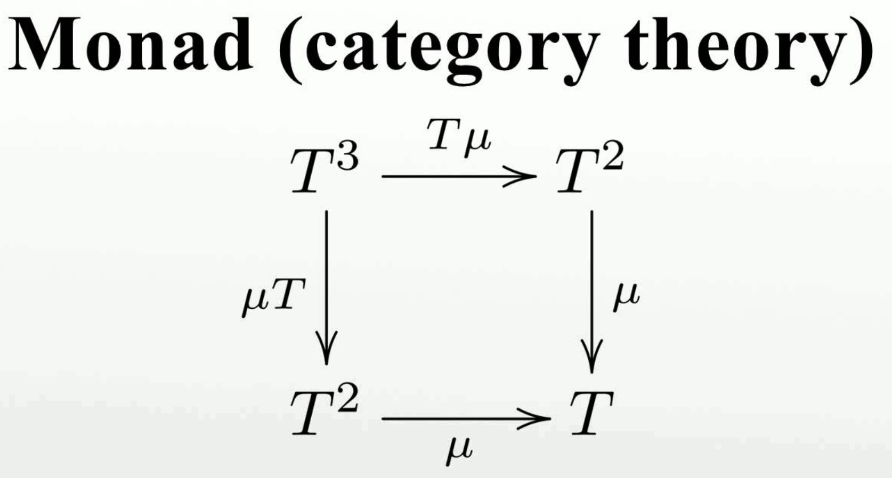

# Reusable FP patterns in 10 minutes

[github.com/lloydmeta](https://github.com/lloydmeta)

---

## What is FP ?

----

Something that helps you write safe, scalable, maintainable code.

Note:

* Safe: memory safety, reasonability (e.g. what does this do)
* Scalable: scales horizontally; turning on concurrent processing can just an additional function call.
* Maintainable: easy to read, understand, and build-on (using basic building blocks).

----

## FP and OOP can co-exist
### ↑ The Scala Way ↑

Note:

* There are strengths and weaknesses in both; pick the best tool for the scale and job
* In my experience, in Scala, for certain definitions of Good, Balance, and Scale, a good fit is:
  * FP in the small, e.g. dealing with data and type-manipulation in the small
  * OOP for wiring, e.g. interfaces for biggish components that deal with different domains and need to talk to each other

---

## FAABOT
### FP as a bag of tricks

Note:

* Shortest route to getting sh*t done

----

  1. Introduce a concept/abstraction (name)
  2. Explain it
  3. Justify it
  4. Example usage

---

## Concepts

* Immutability
* `Option`
* The M word

---

## Immutability

> Unchanging over time or unable to be changed.

[Oxford Dictionary](https://en.oxforddictionaries.com/definition/immutable)

Note:
* Easier-to-reason about the code
  * No need to track down places where changes *could* take place
* Concurrent sharing without fear
  * Yes, I bastardised the Rust motto

----

### 2 different concepts

#### An immutable variable/binding

```scala
val person = Person(/* snip */)
// you cannot now re-assign the binding
person = Cat(/* snip */)
```

Note:
* Makes code easy to reason about

----

### 2 different concepts

#### An immutable data structure

```scala
import scala.collections.immutable
import scala.collections.mutable

val immutableMap = immutable.Map(1 -> "one")
// This does not work
immutableMap += (2 -> "two")

val mutableMap = Map(1 -> "one")
mutableMap += (2 -> "two") // works !
```
----

### 2 different concepts

#### An immutable data structure

This, however will work
```scala
// mutable binding
var immutableMap = immutable.Map(1 -> "one")
immutableMap += (2 -> "two") // works !
```

Note:

* This is baked into the [language spec](https://stackoverflow.com/questions/41774017/where-is-scalas-defined-in-the-context-of-int)
  * It gets re-written
* Makes it easy for you to go switch to an immutable collection from a mutable one

----

### Pro-tip

#### Prefer

```scala
var x = immutable.Map
```
#### Over

```scala
val x = mutable.Map
```

Note:

* No cloning/conversion necessary to share with the outside world
* If you forget to turn your mutable object into an immutable one before sharing it with the outside world via your API, you've just lost all guarantees:
  * "They" can change your state
  * In ways you will never predict
  * Don't

---

## `Option`

There can only be one:
*  `Some[Thing]`
* `None`

----

In Scala

```scala
sealed abstract class Option[A] {
  def unsafeGet: A
}

final case class Some[A](unsafeGet: A) extends Option[A]

case object None extends Option[Nothing] {
  def unsafeGet: A = throw new NoSuchElementException("Don't use this method ever again.")
}
```

Note:
* Obvs. not how this is implemented IRL

----

In Haskell

```haskell
data Maybe a = Just a | Nothing
```

----

Usage

```scala
trait HashMap[K, V] {
  /*
   * For a given key, returns Some[V] if it exists
   * in the map, None otherwise
   */
  def get(key: K): Option[V]
}

```

Note:

- Why? It is obvious from the type signature of a method that
  it might returns something or nothing. What's the point?
  - Design time documentation for future devs, checked by the compiler
  - The compiler will enforce that you're doing it right

----

Usage (cont'd)

```scala
val m = HashMap(
  1 -> List("one", "une", "eins", "いち"),
  2 -> List("two", "deux", "zwei", "に"),
)

assert(m.get(1) === Some(List("one", "une", "eins", "いち")))

assert(m.get(3) === None)
```

----

Pattern matching !

```scala
val oneLocalisations = m.get(1) match {
  case Some(Nil) | None      => 0
  case Some(x :: Nil)        => 1
  case Some(list)            => list.length
}
```

Note:

- Scala will warn if your patterns are non-exhaustive, you can
  turn on fatal warnings to fail your compile if there are warnings

----

But, how do you *really* work with Option[A] ?

Note:

- Pattern matching is nice, but ... it isn't really scalable.
- What about:
  - Multiple methods that return options?
- We don't want the pattern matching pyramid

---

## The M word

Hint: Rhymes with Gonad

----


----


----


----



----

Data in a Context, and along with standard
tools for working with the data

Note:

- Data could be 1 or more values (List)
- Context; some kind of type that acts like a container
- Tools -> methods

----

### Examples of Monadic Contexts

* `Option[A]`: Presence or absence of an `A` value
* `List[A]`: 0 or more `A` values
* `Try[A]`: Successful computation of a value `A` or an Failure holding an `Exception`
* `Future[A]`: Eventual computation of a value `A`, or an eventual Failure holding an `Exception`

Note:
- In all of these cases, you have value(s) of generic type `A`, that you want to work with, inside a "Context" represented by a type

----

### Tools for working with Monads

* `pure`: Given a value `A`, "lifts" it into a monadic context `M[A]`
* `map`: Given a monad `M[A]` and a function `A => B`, returns a `M[B]`
* `flatMap`: Given a monad `M[A]` and a function `A => M[B]`, returns a `M[B]`

----

Quick detour

- Formal definition of a Monad usually come with laws governing said tools
- Depending on the language, some of these names might be different or absent
  - e.g. In Scala, typically the pattern is to not have `pure` and just wrap it with the a constructor
  - In Haskell, `flatMap` is called `bind` and `>>=`, and `map` is also called `<$>`
  - In Rust, `flatMap` is typically `andThen`

Note:

- Haskell defines `map` under `Functor`
- Rust doesn't actually support `Monad`s formally

----

#### We think in Monads *every day*

If I get a salary bump, imma go to Hawaii.

```scala
def maybeSalaryBump: Option[SalaryBump]

def buyVacayPackage(s: SalaryBump): Vacay

def maybeSurpriseVacay: Option[Vacay] = maybeSalaryBump.map(buyVacayPackage)
```

----

#### We think in Monads *every day* (cont'd)

I have a bunch of kids and I need to get them ready to go
outside.

```scala
def dayCareKids: List[Kid]

def dressKidForOutdoors(k: Kid): OutdoorReadyKid

def outdoorReadyKids: List[OutdoorReadyKid] =
  dayCareKids.map(dressKidForOutdoors)
```

----

#### We think in Monads *every day* (cont'd)

When my speakers get here, I'm gonna hook them up to finish
my sweet setup (async!)

```scala
def futureSpeakerDelivery: Future[Speakers]

def hookupToReceiver(s: Speakers): CompleteEntertainmentSystem

def futureSweetSetup: Future[CompleteEntertainmentSystem] =
  futureSpeakerDelivery.map(hookupToReceiver)
```

----

### Option Monad methods

```scala
sealed trait Option[+A] {
  def flatMap[B](f: A => Option[B]): Option[B] =
    this match {
      case None    => None
      case Some(a) => f(a)
    }

  def map[B](f: A => B): Option[B] =
    flatMap(f.andThen(Option.pure(_)))
}
```

Note:

- Not actually how Option is made into a Monad

----

### List Monad methods

```scala
sealed trait List[+A] {
  def flatMap(f: A => List[B]): List[B] = {
    @scala.annotation.tailrec
    def go(acc: List[B], current: List[A]): List[B] =
      current match {
        case Nil     => acc.reverse
        case x :: xs => go(f(x) ::: acc, xs)
      }
    go(Nil, this)
  }

  def map[B](f: A => B): Option[B] =
    flatMap(f.andThen(List.pure(_)))
}
```

----

### Example usage

```scala
val myInts = List(1, 2, 3, 4)
val myIntsIncr = myInts.map(v => v + 1)

assert(myIntsIncr === List(2, 3, 4, 5))

val maybeAge: Option[Int] = Some(3)
val myabeAgeIncr = maybeAge.map(_ + 1)

assert(myabeAgeIncr === Some(4))
```

----

### Example usage (cont'd)

```scala
val maybeFirstName = Some("Joe")
val maybeLastName  = Some("Smith")

case class Person(first: String, last: String)

val maybePerson = maybeFirstName.flatMap { first =>
  maybeLastName.map { last =>
    Person(first = first, last = last)
  }
}

assert(maybePerson === Person("Joe", "Smith"))
```

----

#### Fail fast

```scala
import scala.util._

val tryFirst: Try[String] = Failure(new IllegalArgumentException("Non-UTF8 string"))
val tryLast: Try[String]  = Success("Schmoe")

val tryPerson = tryFirst.flatMap { first =>
  tryLast.map { last =>
    Person(first = first, last = last)
  }
}

assert(tryPerson === tryFirst)
```

----

### Again, how do you *really* work with Monads

Note:

- We've traded pattern matching pyramids for ... map+flatMap pyramids

----

### For-comprehensions

```scala
val tryPerson = for {
    first <- tryFirst
    last  <- tryLast
  } yield Person(first, last)
```

Note:

* Looks magical, but it is purely a mechanical sugar for maps and flatMaps

----

### More generalisation

```scala
import $ivy.{`org.typelevel::cats-core:1.0.1`}
import cats._
import cats.implicits._

case class Person(first: String, last: String)

def buildPerson[M[_]: Monad](mFirst: M[String], mLast: M[String]): M[Person] =
  for {
    first <- mFirst
    last  <- mLast
  } yield Person(first, last)
```

----

`buildPerson` is now general on Monadic context

```scala
import scala.util._
import scala.concurrent._
import scala.concurrent.ExecutionContext.Implicits._

val maybeFirstName: Option[String] = Some("Joe")
val maybeLastName: Option[String]  = Some("Smith")

val tryFirst: Try[String] = Failure(new IllegalArgumentException("Non-UTF8 string"))
val tryLast: Try[String]  = Success("Schmoe")

val firsts = List("Joe", "John", "Mary")
val lasts  = List("Smith", "Clark", "Chan")

val futureFirst = Future.successful("Joe")
val futureLast  = Future.successful("Smith")

val maybePerson  = buildPerson(maybeFirstName, maybeLastName)
val tryPerson    = buildPerson(tryFirst, tryLast)
val persons      = buildPerson(firsts, lasts)
val futurePerson = buildPerson(futureFirst, futureLast) // Async!
```

---

# Why ?

- More general (great for sharable code, libs, etc)
- DRY
- Reusable in different contexts, with different performance characteristics

---

# Resources

1. Learn online, in your browser:
  * [Cats](https://www.scala-exercises.org/cats/semigroup)
  * [FP](https://www.scala-exercises.org/fp_in_scala/getting_started_with_functional_programming)
2. [Haskell Book](http://haskellbook.com/)
3. [Learn you a Haskell](http://learnyouahaskell.com/)